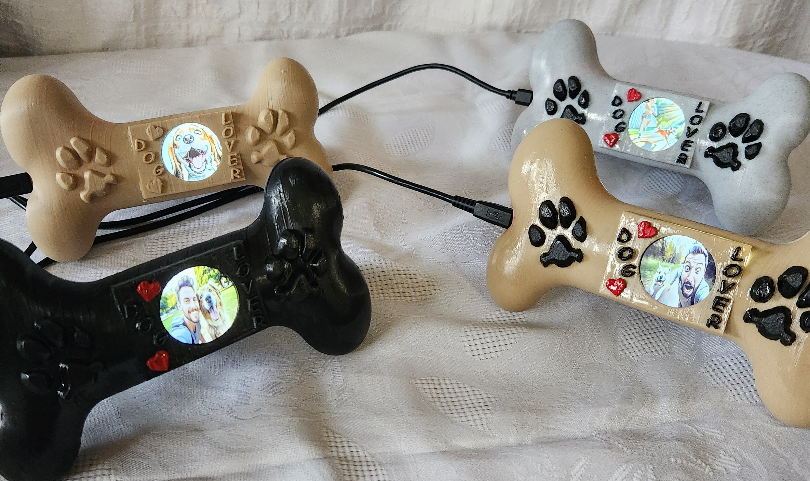

# 🐶 Dog_digital_album – "Dog Lover"  
*A Digital Tribute to Man’s Best Friend*



## Overview
**Dog Lover** is a mini digital photo frame project that lovingly cycles through **7 cherished dog photos** using an **ESP32** microcontroller and a **1.83" GC9A01 round LCD**. It's a small but meaningful tribute to the companionship and joy that dogs bring to our lives.

---

## 📸 Features
- Displays 7 rotating dog photos in full color.
- Round LCD screen gives a unique and cozy look.
- Custom 3D-printable case designed for tabletop display.
- Minimal hardware — just an ESP32, LCD, and M2 screws.

---

## 🧾 Bill of Materials (BOM)
| Item         | Description                          |
|--------------|--------------------------------------|
| ESP32        | Any common dev board (e.g., WROOM32) |
| GC9A01 LCD   | 1.83" Round TFT Display              |
| M2 Screws    | For mounting case                    |
| 3D-Printed Case | STL files included in `example_photos/` |

---

## 🔌 Circuit Schematic


---

## 🖼️ Image Conversion Instructions

1. Place 7 dog photos inside the folder:

2. Run the Python conversion script:

3. The script will:
- Convert each photo to `.png`.
- Generate `.h` files with image data.

4. Copy the contents of the generated `.h` files into:
Example:
```c
unsigned char headers_photo22_png[] = { /* image data */ };

🖨️ 3D Printing Instructions
📁 STL Files
STL files are located in:

Copy
Edit
example_photos/
🧭 Orientation & Photos
Top Part:
Tilt at -30 degrees from upright
(example_photos\top_stl_tilted.jpg)

Bottom Part:
Use default Bambu Studio settings with correct orientation
(example_photos\bottom_stl_position.jpg)

⚙️ Recommended Print Settings
Setting	Value
Layer Height	0.2 mm
Wall Thickness	2.0 mm
Wall Line Count	5
Horizontal Expansion	0
Top Thickness	2.0 mm
Bottom Thickness	2.0 mm
Infill	15%
Print Speed	45 mm/s
Support

📬 Contact
Want to showcase your own dog? Remix this for another pet?
Let’s collaborate and make tech more lovable 🐾