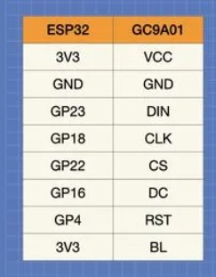
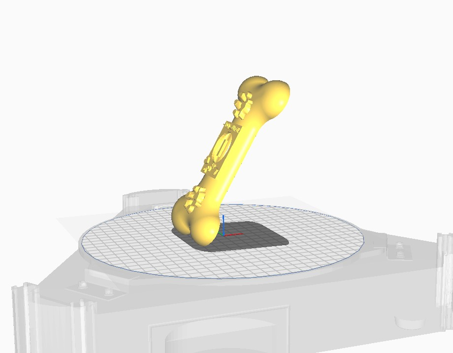
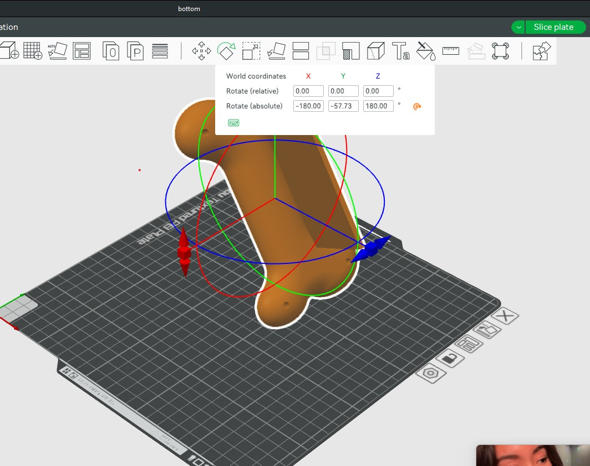

# 🐶 Dog_digital_album – "Dog Lover"  
*A Digital Tribute to Man’s Best Friend*


## Overview
**Dog Lover** is a mini digital photo frame project that lovingly cycles through **7 cherished dog photos** using an **ESP32** microcontroller and a **1.83\" GC9A01 round LCD**. It's a small but meaningful tribute to the companionship and joy that dogs bring to our lives.

---

## 📸 Features
- Displays 7 rotating dog photos in full color.
- Round LCD screen gives a unique and cozy look.
- Custom 3D-printable case designed for tabletop display.
- Minimal hardware — just an ESP32, LCD, and M2 screws.

---

## 🧾 Bill of Materials (BOM)

| Item            | Description                          |
|-----------------|--------------------------------------|
| ESP32           | Any common dev board (e.g., WROOM32) |
| GC9A01 LCD      | 1.83" Round TFT Display              |
| M2 Screws       | For mounting case                    |
| 3D-Printed Case | STL files included in `example_photos/` |

---

## 🔌 Circuit Schematic



---

## 🖼️ Image Conversion Instructions

1. Place 7 dog photos inside the folder:
src/photos/

markdown
Copy
Edit

2. Run the Python conversion script:
python3 photo_conversion.py

markdown
Copy
Edit

3. The script will:
- Convert each photo to `.png`
- Generate `.h` files with image data

4. Copy the contents of the generated `.h` files into:
dog_digital_display/photos.h

cpp
Copy
Edit

Example:
```c
unsigned char headers_photo22_png[] = { /* image data */ };
🖨️ 3D Printing Instructions
📁 STL Files
STL files are located in:

Copy
Edit
example_photos/
### 🧭 Orientation & Photos

- **Top Part:**  
  Tilt at **-30 degrees from upright**  
  

- **Bottom Part:**  
  Use **default Bambu Studio settings** with correct orientation  
  

📬 Contact
Want to showcase your own dog? Remix this for another pet?
Let’s collaborate and make tech more lovable 🐾

📧 aarongumba2016@gmail.com

